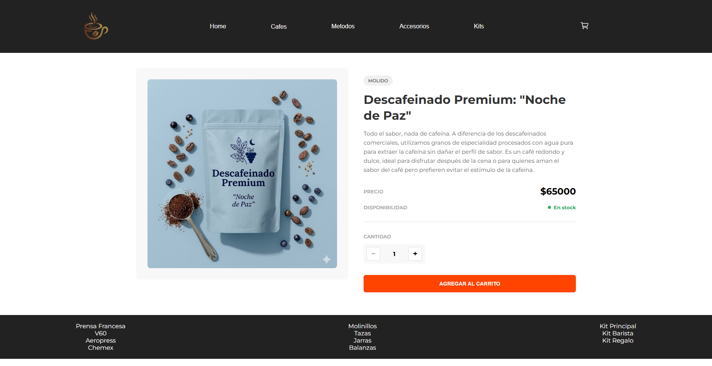

# DonRamon — E-commerce en React

Tienda online de una cafetería: catálogo con filtros por categoría, detalle de producto,
carrito persistente y checkout con generación de orden.



**[Ver en vivo](https://proj-cafeteria-react-app.vercel.app)**

---

## Qué es

Proyecto final de la cursada de React JS en CoderHouse: una SPA con catálogo, carrito y
checkout persistido en Firebase.

**El diseño no estaba en la consigna.** Se aprobaba con una interfaz mínima, pero armé
una propia —partiendo de referencias visuales— porque un e-commerce que no se entiende de
un vistazo no cumple su función, por más que el código funcione.

**Mi rol:** diseño de la interfaz e implementación completa.

---

## Qué hace

- **Catálogo** de productos con filtrado por categoría
- **Detalle de producto** con descripción y selector de cantidad
- **Carrito** con agregado, eliminación, modificación de cantidades y cálculo de totales
- **Persistencia local**: el carrito sobrevive al refresh del navegador
- **Checkout** con formulario validado que genera la orden en Firestore y devuelve el ID
  de compra
- **Notificaciones** en pantalla ante cada acción del usuario

---

## Decisiones

**El carrito vive en un Context, no en props.** El estado del carrito lo necesitan el
header, el catálogo, el detalle y el checkout: pasarlo por props hubiera significado
atravesar media aplicación con datos que los componentes del medio no usan. `CartContext`
expone las operaciones y cada componente toma solo lo que necesita.

**El carrito se sincroniza con `localStorage`.** Un `useEffect` escribe el carrito en cada
cambio, para que el usuario no pierda su compra si cierra la pestaña. En un e-commerce
real, perder el carrito es perder la venta.

**Sumar un producto que ya está en el carrito no lo duplica.** `addToCart` revisa primero
si el ítem existe y, en ese caso, acumula la cantidad en lugar de agregar una fila nueva.
Del mismo modo, bajar la cantidad a cero elimina el producto en vez de dejarlo en el
carrito con cantidad cero.

**Los totales se derivan, no se guardan.** Cantidad total y precio total se calculan con
`reduce` sobre el carrito cada vez que se necesitan, en lugar de mantenerse como estado
aparte. Un total guardado es un dato más que puede quedar desincronizado.

**Diseñé la interfaz antes de codearla.** Definir jerarquía, espaciado y estados de
antemano hace que el CSS sea una traducción y no una improvisación.

---

## Datos

- **JSON local** para el catálogo de productos
- **Firebase / Firestore** para las órdenes de compra

---

## Stack

**React 19** · **Vite 7** · **React Router 7** para la navegación · **Firebase 12**
(Firestore) · **React Hook Form** para la validación del checkout ·
**React Hot Toast** para las notificaciones · **React Icons** · ESLint

---

## Cómo correrlo

```bash
git clone https://github.com/iTzTomitox/ProjCafeteria-ReactApp.git
cd ProjCafeteria-ReactApp
npm install
npm run dev
```

---

**Tomas Beron** — [Portfolio](https://portfolio-tomas-beron.vercel.app) · [LinkedIn](https://linkedin.com/in/tomas-beron) · [Behance](https://behance.net/tomasberon)